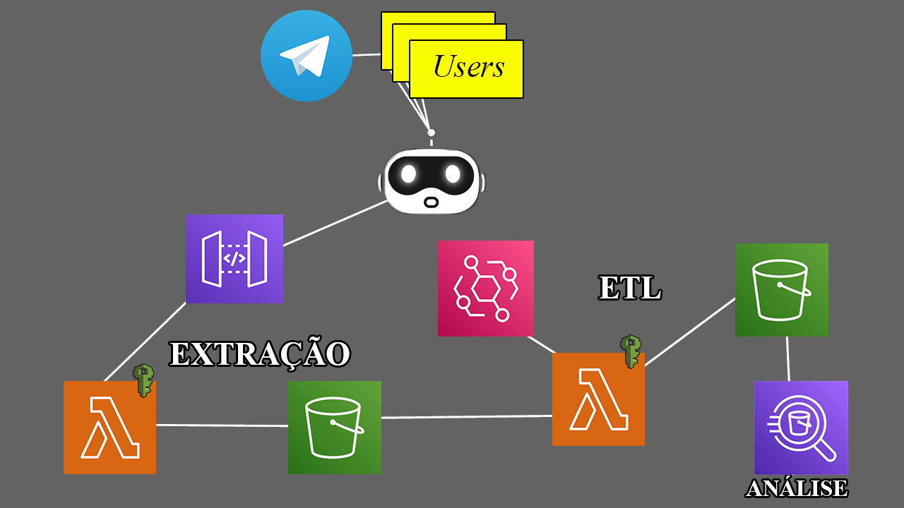

# Pipeline de Dados do Telegram

Este é um projeto de pipeline de dados que coleta mensagens de grupos do Telegram, realiza transformações (ETL) e permite consulta dos dados usando serviços da AWS, como Amazon S3, AWS Lambda e Amazon Athena.

## Índice

- [Visão Geral](#visão-geral)
- [Configuração Inicial](#configuração-inicial)
- [Coleta de Dados (Extração)](#coleta-de-dados-extração)
- [Transformação de Dados (ETL)](#transformação-de-dados-etl)
- [Consulta de Dados com AWS Athena](#consulta-de-dados-com-aws-athena)
- [Contribuindo](#contribuindo)
- [Licença](#licença)

## Visão Geral

Este projeto tem como objetivo criar um pipeline de dados completo para coletar, processar e consultar mensagens de grupos do Telegram. O pipeline é dividido em três etapas principais:

### Configuração Inicial

Antes de começar, é necessário configurar as credenciais da AWS, criar um bot do Telegram e definir os grupos a serem monitorados.

### Coleta de Dados (Extração)

Nesta etapa, o bot do Telegram lê as mensagens dos grupos e as envia para um bucket no Amazon S3 por meio de uma API personalizada. Uma função Lambda é acionada para organizar os dados em arquivos brutos no S3.

### Transformação de Dados (ETL)

A segunda etapa envolve o agendamento de uma função Lambda para executar o ETL nos dados brutos armazenados no S3. Os dados transformados são armazenados em outro bucket no S3 para consulta.

### Consulta de Dados com AWS Athena

Finalmente, os dados podem ser consultados e analisados usando o Amazon Athena, permitindo a criação de visualizações, relatórios e análises com consultas SQL interativas.

## Coleta de Dados (Extração)

Detalhes sobre como configurar a coleta de dados estão disponíveis em [Coleta de Dados (Extração)](coleta-de-dados.md).

## Transformação de Dados (ETL)

A segunda etapa envolve a configuração do agendamento para acionar a função Lambda de ETL. Saiba mais em [Transformação de Dados (ETL)](transformacao-de-dados.md).

## Consulta de Dados com AWS Athena

Após a transformação dos dados, você pode consultar e analisar os dados usando o Amazon Athena. Veja mais informações em [Consulta de Dados com AWS Athena](consulta-de-dados.md).

## Contribuindo

Sinta-se à vontade para contribuir para este projeto, relatando problemas, enviando solicitações de pull ou melhorando a documentação. Consulte o [guia de contribuição](CONTRIBUTING.md) para obter mais informações.

## Licença

Este projeto está licenciado sob a [Licença MIT](LICENSE.md). Consulte o arquivo [LICENSE.md](LICENSE.md) para obter detalhes.
